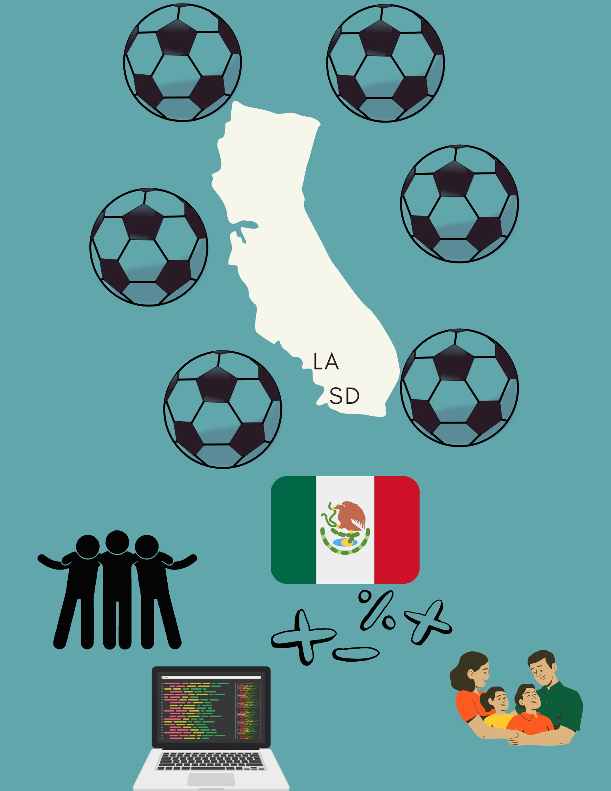
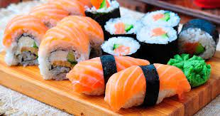

# Jared Baza's blog

<button onclick = "window.location.href='https://github.com/JBaza12';">My github account</button>
 

- ## About Me

## Favorite Soccer Player: Lionel Messi

](<messi gif.gif>)
## Favorite Food: Sushi

<button onclick = "window.location.href='https://www.youtube.com/watch?v=suhlSjSzMUk';">Favorite Song(Click Me!)</button>

- ### What is your favorite subject?(Mine's Math)
<input list="subjects">
<datalist id="subjects">
<option>Math</option>
<option>Science</option>
<option>English</option>
<option>History</option>
<option>Coding!</option>
</datalist>

-  Hover your mouse over me!
 
<marquee> I AM READY TO CODE!!!</marquee>

